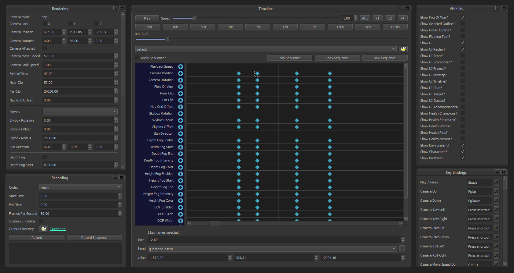

## League Director
[](https://github.com/riotgames/leaguedirector/blob/master/LICENSE)
[](https://www.python.org/downloads/release/python-372/)
[](https://www.qt.io/qt-for-python)
[](https://discord.gg/7j5fdRp)

League Director 录制英雄联盟回放的工具.**[下载官方最新版本 Release](https://github.com/riotgames/leaguedirector/releases/latest)**




## 如何使用

**注意: 仅限于Windows**

1. **[下载 League Director](https://github.com/riotgames/leaguedirector/releases/latest)** 从 releases 页面安装.
2. 启动 League Director 并确保选中安装旁边的复选框.
3. 启动英雄联盟并启动回放。 League Director会自动连接.
4. 在游戏中打开选项菜单（ESC 键）并确保您的视频图形设置,设置为非常高。 如果您确实需要更改视频图形设置，则需要重新启动回放以启用天空盒等其他渲染功能.
5. 从游戏中的相机模式下拉菜单中选择 FPS 相机.
6. 使用数字键盘键（4、5、6、8）和鼠标，您可以自由移动相机。 相机的键绑定也可以在游戏选项中更改.


## 常见问题
**如何更改相机移动的按键绑定？?**

FPS相机的前、后、左、右键绑定实际上是在游戏选项屏幕中设置的。运行回放后，打开选项屏幕（ESC），然后进入“热键”和“第一人称相机”部分。.


**为什么天空是黑色的?**

**为什么天空不会改变?**

League Director要求将你的游戏设置为最高图形设置。运行回放后，打开选项屏幕（ESC），然后在“视频”部分下将图形选项设置为“非常高”。更改此设置后，必须重新启动回放才能使其生效。.


**League Director 没有在选项屏幕上显示我的游戏安装？**

**League Director 没有连接到我的回放?**

如果League Director未能正确找到并配置您的游戏客户端，请不要担心，因为您可以手动完成。只需打开一个安装游戏的资源管理器窗口，然后在Config文件夹中查找名为“game.cfg”的文件。右键单击并使用记事本打开此文件，并在标有“[General]”的部分下，确保将值设置为以下内容。.

```
EnableReplayApi=1
```

如果该选项已列出，请确保将其设置为 1。如果该选项根本没有列出，只需将其添加到列表底部即可。更改此值后，需要重新启动回放才能使其生效。


